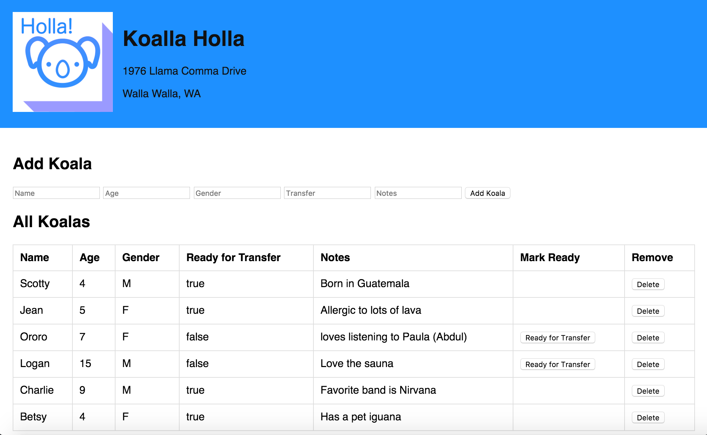

This must stop:
---------------

Koala Holla
===========

Our client, Koala Holla (1976 Llama Comma Drive, Walla Walla WA) is a non-profit dedicated to the ethical transitioning of koalas from the outdoors (whereupon they may be rained) to urban areas where roofs exist. Your team has been hired to build a web app to handle their terrarium residents.

Technologies
------------
* JQuery
* Node
* Express
* SQL

Client needs
------------
Koala Holla has provided a table of their current inventory:

| id | name    | gender | age | ready_to_transer | notes                            |
|----|---------|--------|-----|------------------|----------------------------------|
| 1  | Scotty  | M      | 4   | Y                | Born in Guatemala                |
| 2  | Jean    | F      | 5   | Y                | Allergic to lots of lava         |
| 3  | Ororo   | F      | 7   | N                | Loves listening to Paula (Abdul) |
| 4  | Logan   | M      | 15  | N                | Loves the sauna                  |
| 5  | Charlie | M      | 9   | Y                | Favorite band is Nirvana         |
| 6  | Betsy   | F      | 4   | Y                | Has a pet iguana                 |

They need the ability to add a Koala to the database. Make a form with the appropriate info. Save the koala in the database. Think about what data types you'll be needing for your table columns.  

They need the ability for mark a Koala ready for transfer. Each koala in your UI needs a button in that reads 'Ready for Transfer'. When the user clicks on the button, it should update the database for the specific Koala. The 'Ready for Transfer' button should only appear for Koalas that haven't yet been marked ready for transfer.

Delivery
--------
Upon completion of the project you'll need to provide not only the source (via GitHub url), but also instructions on how the database table should be set up. This can be in a simple `database.sql` file in the repo.

### STRETCH GOALS

1. Ability to delete a specific Koala from the database.  
2. Confirmation dialog before deleting (research SweetAlert).
3. Ability to toggle the display of Koalas ready for transfer.
4. Add form validation, additional styling and a README.md.
5. Client side filtering with a text box
6. Ability to edit other information (Name, Age, Notes) for existing Koalas in the db.

### Sample Wireframe
--------
Your final product may look something like this:

